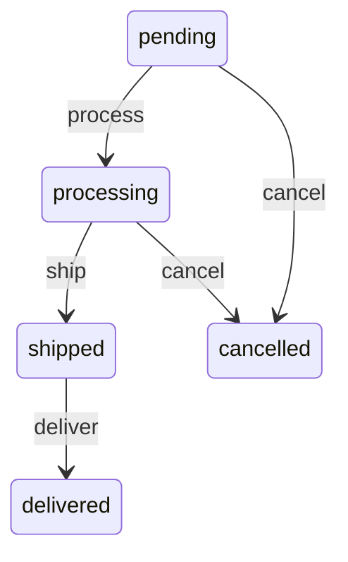
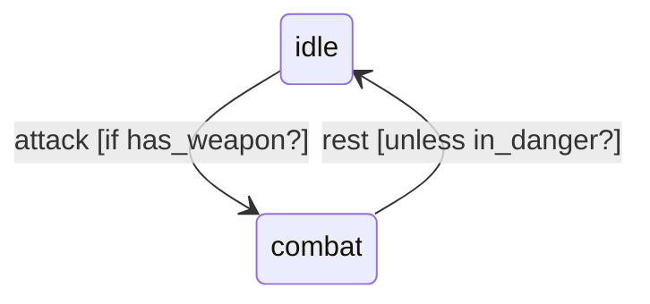

# StateMachines::Mermaid

[](https://github.com/state-machines/state_machines-mermaid/actions/workflows/ruby.yml)
[](https://rubygems.org/gems/state_machines-mermaid)
[](https://www.ruby-lang.org)

Mermaid diagram renderer for [state_machines](https://github.com/state-machines/state_machines). Generate Mermaid state diagrams from your state machines.

## Installation

Add this line to your application's Gemfile:

```ruby
gem 'state_machines-mermaid'
```

And then execute:

    $ bundle install

Or install it yourself as:

    $ gem install state_machines-mermaid

## Usage

### Basic Usage

```ruby
require 'state_machines-mermaid'

class Order
  state_machine :status, initial: :pending do
    event :process do
      transition pending: :processing
    end
    
    event :ship do
      transition processing: :shipped
    end
    
    event :deliver do
      transition shipped: :delivered
    end
    
    event :cancel do
      transition [:pending, :processing] => :cancelled
    end
    
    state :delivered, :cancelled do
      def final?
        true
      end
    end
  end
end

# Generate Mermaid diagram
puts Order.state_machine(:status).draw
```

This generates:



### With Conditions

```ruby
class Character
  state_machine :status, initial: :idle do
    event :attack do
      transition idle: :combat, if: :has_weapon?
    end
    
    event :rest do
      transition combat: :idle, unless: :in_danger?
    end
  end
end

# Generates transitions with conditions
puts Character.state_machine(:status).draw
```

Output includes conditions:



### Show Callbacks

```ruby
# Include callback information in the diagram
Character.state_machine(:status).draw(show_callbacks: true)
```

### Output to File

```ruby
File.open('state_diagram.mmd', 'w') do |file|
  Order.state_machine(:status).draw(io: file)
end
```

### Integration with Mermaid Tools

The generated output is compatible with:

- [Mermaid Live Editor](https://mermaid-js.github.io/mermaid-live-editor/)
- GitHub Markdown (renders Mermaid diagrams natively)
- Various documentation tools (GitLab, Notion, etc.)
- Mermaid CLI for generating PNG/SVG files

### Example: Complex State Machine

```ruby
class Dragon
  state_machine :mood, initial: :sleeping do
    state :sleeping, :hunting, :hoarding, :rampaging
    
    event :wake_up do
      transition sleeping: :hunting, if: :hungry?
      transition sleeping: :hoarding, if: :treasure_nearby?
    end
    
    event :find_treasure do
      transition hunting: :hoarding
      transition hoarding: same  # Keep hoarding
    end
    
    event :enrage do
      transition any - :rampaging => :rampaging
    end
  end
end

puts Dragon.state_machine(:mood).draw
```

## Features

- Generates valid Mermaid state diagram syntax
- Supports initial and final states
- Shows transition conditions (if/unless)
- Handles self-transitions (loopbacks)
- Sanitizes state names for Mermaid compatibility
- Optional callback visualization
- Compatible with all state_machines features

## Development

After checking out the repo, run `bin/setup` to install dependencies. Then, run `rake test` to run the tests.

## Contributing

Bug reports and pull requests are welcome on GitHub at https://github.com/state-machines/state_machines-mermaid.

## License

The gem is available as open source under the terms of the [MIT License](https://opensource.org/licenses/MIT).
